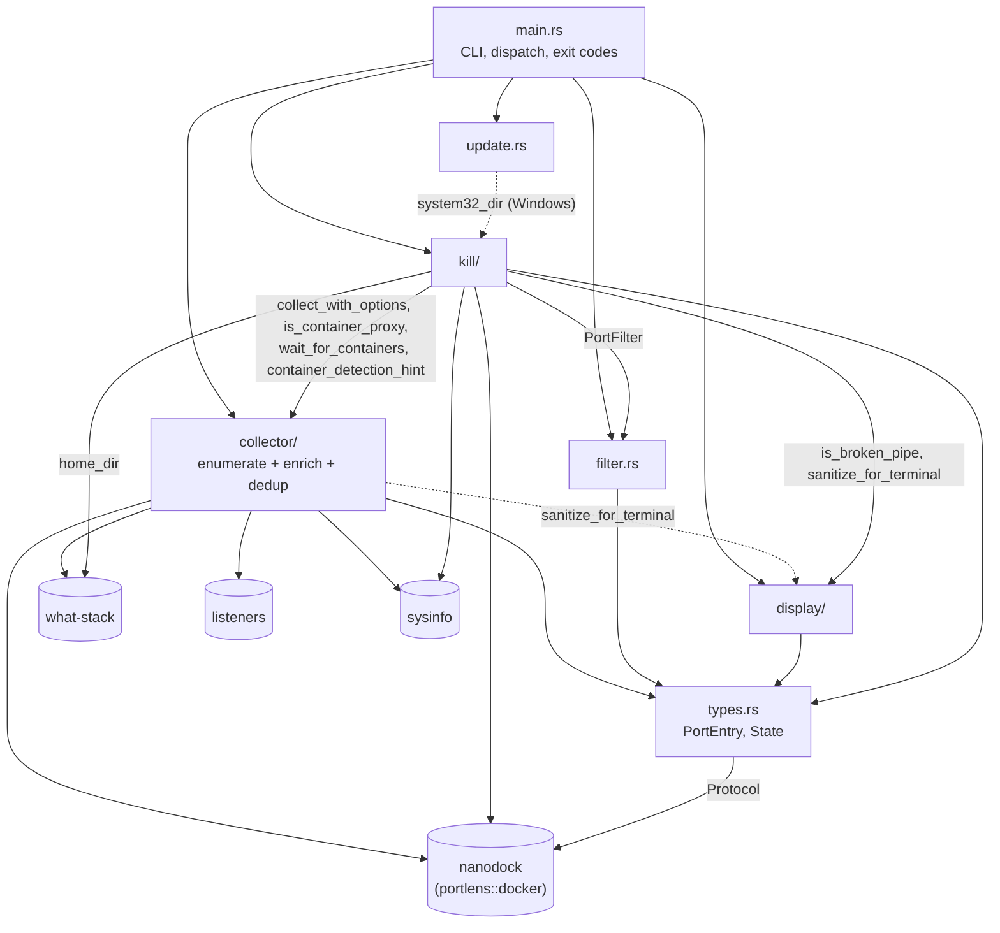
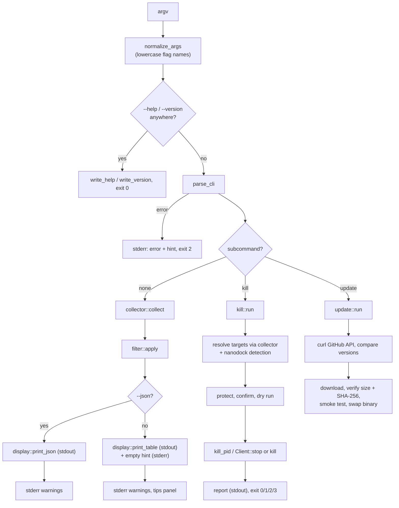
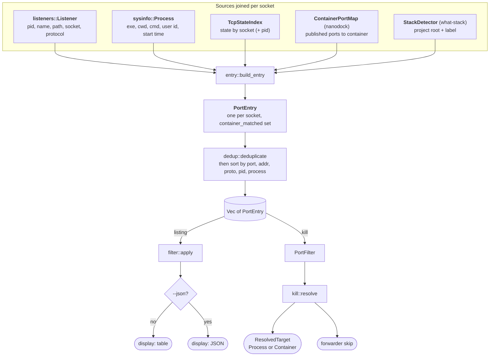

# PortLens Architecture

This document explains how the `portlens` crate is put together: what each module owns, how data moves from the command line to the terminal, and the non-obvious decisions that keep it correct. It is written for a developer who is new to the codebase and wants to change it with confidence. User-facing behavior (flags, columns, exit codes) is documented in [README.md](../README.md); this document links behavior to code.

Facts here describe crate version 0.3.0 (edition 2024, MSRV 1.89). File paths are relative to the repository root. Function and type names are given exactly as they appear in the source so you can grep for them.

## Contents

1. [What portlens is](#1-what-portlens-is)
2. [Repository map](#2-repository-map)
3. [Big picture](#3-big-picture)
4. [Core data model](#4-core-data-model)
5. [Module by module](#5-module-by-module)
6. [Key flows, end to end](#6-key-flows-end-to-end)
7. [Platform differences](#7-platform-differences)
8. [The nanodock and what-stack boundary](#8-the-nanodock-and-what-stack-boundary)
9. [Cross-cutting concerns](#9-cross-cutting-concerns)
10. [Design decisions and invariants](#10-design-decisions-and-invariants)
11. [Where to start for common changes](#11-where-to-start-for-common-changes)
12. [Known gaps and stale documentation](#12-known-gaps-and-stale-documentation)

## 1. What portlens is

PortLens is a single-binary CLI that lists the open TCP and UDP sockets on the local machine and tells a developer what is behind each one: the owning process and PID, the user, how long the process has been up, the project folder it runs from (or the Docker/Podman container that publishes the port), and a framework or service label such as `Next.js` or `PostgreSQL`. By default it hides sockets it cannot connect to a project or a known tool, so the output stays focused on development servers. It renders a width-aware table (bordered or compact) or a JSON array.

It also has two subcommands. `portlens kill` frees a port (or terminates a PID) safely: it resolves the port to processes, stops a container through the container runtime's API instead of killing its port proxy, refuses to touch critical operating system processes, and re-verifies each process's identity right before signaling it. `portlens update` checks GitHub Releases and, on x86_64 Windows and x86_64 Linux (non-package-managed), replaces the running binary after checksum and smoke-test verification.

Container runtime work is delegated to the sibling crate `nanodock`, and project and stack detection to the sibling crate `what-stack`. Both are consumed from crates.io (`nanodock 0.2.0`, `what-stack 0.1.1`), not by path.

## 2. Repository map

| Path | Lines (incl. tests) | Responsibility |
| --- | --- | --- |
| `src/main.rs` | 1089 | Binary entry point: argument normalization, parsing, help text, dispatch, listing orchestration, stderr warnings, exit codes, `--trace` logger |
| `src/lib.rs` | 35 | Library root. Exposes modules as `#[doc(hidden)] pub` so the binary target and the benchmarks can reach them; re-exports `nanodock` as `portlens::docker` |
| `src/types.rs` | 253 | `PortEntry`, `State`, `AppLabel`, re-exported `Protocol`, `strip_windows_exe_suffix` |
| `src/collector/mod.rs` | 391 | `collect`: orchestrates socket enumeration, process refresh, container detection, enrichment, dedup and sort; container and privilege warnings |
| `src/collector/entry.rs` | 439 | `build_entry`: turns one `listeners::Listener` into one `PortEntry` |
| `src/collector/resolve.rs` | 282 | Container lookup for a socket; `is_container_proxy` shared with `kill` |
| `src/collector/dedup.rs` | 592 | Pure deduplication and container-proxy collapsing |
| `src/collector/tcp_state.rs` | 694 | `TcpStateIndex`: TCP states from `/proc/net/tcp{,6}` (Linux) or `GetExtendedTcpTable` (Windows) |
| `src/collector/user.rs` | 314 | `UserResolver` (uid or SID to name) and elevation detection |
| `src/filter.rs` | 1109 | `PortFilter`, `FilterOptions`, `apply`, the developer-relevance filter |
| `src/display/mod.rs` | 176 | Public rendering API: `print_table`, `print_json`, `print_tips`, `print_empty_hint`, `is_broken_pipe` |
| `src/display/table.rs` | 826 | `Column` model and the table layout engine |
| `src/display/render.rs` | 469 | Cell, border, width and truncation primitives; `sanitize_for_terminal` |
| `src/display/terminal.rs` | 303 | Terminal width and UTF-8 border detection (all display FFI lives here) |
| `src/display/tips.rs` | 350 | "Quick Actions" footer panel |
| `src/kill/mod.rs` | 1222 | `kill::run`: confirmation, protection rules, dry run, execution, exit codes |
| `src/kill/resolve.rs` | 679 | Port or PID to `ResolvedTarget`s (processes, containers, skipped forwarders) |
| `src/kill/platform.rs` | 643 | `kill_pid`, `pid_exists`, `ProcessIdentity` snapshots, Windows handle-based termination |
| `src/kill/report.rs` | 588 | `KillReportEntry`, `KillStatus`, human and JSON kill reports |
| `src/update.rs` | 1848 | Self-update: GitHub API via `curl`, URL allow-listing, SHA-256 verification, smoke test, binary swap |
| `build.rs` | 56 | Embeds the icon and version resource into Windows executables |
| `benches/benchmarks.rs` | 391 | Criterion benchmarks for the filter engine and nanodock JSON parsing |
| `scripts/` | | Cross-target clippy gate, benchmark budget check, git hook installers (`install-hooks.{sh,ps1}`), commit-message check |
| `hooks/` | | The git hooks themselves: `pre-commit` (fmt, cross-target clippy, tests), `pre-push` (full CI-like gate), `commit-msg` (Conventional Commits), each with a `.bat` variant |

There is no `tests/` directory: all ~300 tests are inline `#[cfg(test)] mod tests` blocks at the bottom of each source file.

## 3. Big picture

### Module dependencies

The listing pipeline is strictly one-directional: `collector` produces `Vec<PortEntry>`, `filter` narrows it, `display` renders it. `kill` reuses the collector instead of enumerating sockets itself, so every platform quirk (IPv4/IPv6 duplicates, `SO_REUSEPORT` workers, Windows PID-0 rows) is handled in exactly one place.

### The three paths through `main`

### Output stream discipline

Data goes to stdout; everything meant for a human goes to stderr. stdout carries the table, the JSON array, the kill report, the kill dry-run listing, and `--help` / `--version` output. stderr carries errors, the empty-result hint, container and privilege warnings, the tips panel, the kill confirmation prompt, all `update` progress text, and `--trace` diagnostics. This split is what lets `portlens --json | jq` and `portlens | grep node` stay clean, and CONTRIBUTING asks that it be preserved.

## 4. Core data model

### `PortEntry` (src/types.rs)

One row of the listing: one open socket, enriched. It derives `Serialize`, so the JSON output is exactly this struct.

| Field | Type | Filled by | Notes |
| --- | --- | --- | --- |
| `port` | `u16` | `listeners` socket | Local port |
| `local_addr` | `IpAddr` | `listeners` socket | Rows on different bind addresses stay distinct |
| `proto` | `Protocol` | `listeners` protocol | `nanodock::Protocol` re-exported (`Tcp` / `Udp`); serializes as `"TCP"` / `"UDP"` |
| `state` | `State` | `TcpStateIndex` | `NotApplicable` (`"-"`) for UDP; `Unknown` when the OS table has no answer |
| `pid` | `u32` | `listeners` process | |
| `process` | `Arc<str>` | `listeners` process name | Interned per scan so worker pools share one allocation |
| `user` | `Arc<str>` | `UserResolver` | `"-"` when unknown; cached per uid/SID |
| `project` | `Option<String>` | container name, else what-stack project name | Only with deep enrichment |
| `app` | `Option<AppLabel>` | what-stack | `AppLabel = Cow<'static, str>`, borrowed for built-in labels |
| `uptime_secs` | `Option<u64>` | sysinfo start time | `None` when start time is 0 or in the future |
| `container_matched` | `bool` | container resolution | `#[serde(skip)]`: internal signal for dedup, never in JSON |

`State` has 15 variants covering every Linux and Windows TCP state plus `Unknown` and `NotApplicable`. Its `Display` and serde names are the same uppercase tokens (`LISTEN`, `SYN_RECV`, `DELETE_TCB`, `-`).

`strip_windows_exe_suffix` (also in `src/types.rs`) removes a trailing `.exe` case-insensitively. It is used by the `--process` filter; container proxy name matching does its own suffix handling inside nanodock.

### Other types by stage

| Stage | Type | Defined in | Role |
| --- | --- | --- | --- |
| CLI | `Cli`, `Command` | `src/main.rs` | Parsed flags; `Command::Update { check }`, `Command::Kill { port, pid, force, yes, dry_run, json }` |
| Collect | `CollectOptions` | `src/collector/mod.rs` | Single knob: `deep_enrichment` (off with `--no-enrich`) |
| Collect | `Collection` | `src/collector/mod.rs` | `entries`, `container_error: Option<docker::Error>`, `containers_truncated` |
| Collect | `CollectContext<'a>` | `src/collector/mod.rs` | Shared caches threaded through every `build_entry` call (sysinfo `System`, user cache, container map, TCP states, `StackDetector`, process-name interner, rootless Podman resolver) |
| Collect | `TcpStateIndex` | `src/collector/tcp_state.rs` | `HashMap<(SocketAddr, Option<pid>), State>` |
| Collect | `UserResolver` | `src/collector/user.rs` | Username cache (uid on Unix, SID string on Windows) |
| Filter | `PortFilter`, `FilterOptions` | `src/filter.rs` | `Single(u16)` or `Range { start, end }`; the filter flags |
| Display | `DisplayOptions` | `src/display/mod.rs` | `show_header`, `full`, `compact` |
| Kill | `KillTarget`, `KillOptions` | `src/kill/mod.rs` | `Port(PortFilter)` or `Pid(u32)`, plus `force`, `yes`, `dry_run`, `json` |
| Kill | `ResolvedTargets`, `ResolvedTarget`, `Target`, `ContainerTarget` | `src/kill/resolve.rs` | What to act on, and forwarders skipped up front |
| Kill | `ProcessIdentity`, `ProcessOrigin`, `KillOutcome` | `src/kill/platform.rs` | Resolve-time identity (name, start time, origin, exe name) and per-attempt outcome |
| Kill | `KillReportEntry`, `KillStatus` | `src/kill/report.rs` | One report row; stable kebab-case status tokens for JSON |
| Update | `Release`, `Asset`, `UpdateTarget` | `src/update.rs` | Minimal GitHub release model; `UpdateTarget` is the chosen asset plus the expected digest and version used to verify it |

### How a socket becomes a row

The kill path collects with `deep_enrichment: false`, so its rows can differ from the listing's (see invariant 8 in section 10).

## 5. Module by module

### 5.1 `src/main.rs`: CLI and orchestration

**Responsibility.** Turn `argv` into a `Cli`, dispatch to a subcommand or run the listing pipeline, and map results to exit codes. It is the only place that decides exit codes for the listing path and the only place that prints the post-listing warnings and tips.

**Argument handling, in order:**

1. `normalize_args` ASCII-lowercases flag names (including the key of `--flag=value`) and a subcommand name in command position, so `--GREP`, `-A` and `KILL` work. Values are kept as typed; arguments that are not valid Unicode pass through untouched. It knows which flags take a value (`VALUE_FLAGS`) so a value such as `--grep KILL` is never mistaken for a subcommand.
2. `--trace` is detected on the normalized list before parsing so the logger (`StderrTraceLogger`, format `[LEVEL module] message`) covers argument validation too. Without `--trace` no logger is installed and `log` macros are no-ops. Because the logger is global, nanodock and what-stack `debug!` output also appears under `--trace`.
3. `--help`/`-h` and `--version`/`-v` short-circuit before parsing, so they work even next to invalid flags. The check matches any normalized token, including a flag's value, so `portlens --grep -h` prints help. A closed pipe while writing them is a clean exit (`exit_after_output`).
4. `parse_cli` uses `pico-args`. `split_main_args_and_command` recognizes `update` or `kill` only as the first argument (optionally after `--trace`); `--trace` may appear anywhere and is always handed to the top-level parser. A top-level flag placed before a subcommand leaves the subcommand in the top-level parser's leftovers, which gets the targeted error "'kill' must be the first argument; top-level options cannot be combined with a subcommand" (after `validate_main_flag_conflicts`, which runs first). A top-level flag placed after the subcommand goes to the subcommand's own parser and is rejected as "unexpected arguments for 'kill' subcommand".
5. Validation: `--tcp` with `--udp`, `--listen` with `--udp`, and `--process` with `--grep` conflict (`validate_main_flag_conflicts`); `kill` needs exactly one of `--port` or `--pid` (`validate_kill_selector`); port 0 (single or range start) is rejected (`validate_port_filter`). `PortFilter::from_str` rejects reversed ranges and non-numbers.

**Listing orchestration (`run`).** Calls `collector::collect`, builds `FilterOptions`, calls `filter::apply`, renders JSON or a table, then: the empty hint (only when the table is empty, not JSON, and stderr is a terminal), `print_listing_warnings` (only when stderr is a terminal), and the tips panel (only when not JSON, not `--no-tips`, `PORTLENS_NO_TIPS` unset or empty, and stdout is a terminal).

**Deliberately does not:** contain any socket, filtering or rendering logic. Note that `-f` means `--full` at top level but `--force` under `kill`, and `-v` is `--version` (there is no verbose flag; use `--trace`).

### 5.2 `src/lib.rs`: library facade

The crate is CLI-first. Every module is `#[doc(hidden)] pub` because the binary target (`src/main.rs` imports `portlens::{collector, display, filter}`, `portlens::kill`, `portlens::update`) and `benches/benchmarks.rs` are separate crates that reach them through the library; treat them as unstable internals, not an API. `pub use nanodock as docker;` makes nanodock reachable as `crate::docker` everywhere in the crate, which is why container code reads `docker::Client`, `docker::ContainerPortMap`, and so on.

### 5.3 `src/collector/`: enumerate and enrich

#### `collector/mod.rs`: the orchestrator

**Key items:** `collect`, `collect_with_options`, `CollectOptions`, `Collection`, `CollectContext`, `wait_for_containers`, `container_detection_hint`, `CONTAINER_TRUNCATION_HINT`, `visibility_warning`.

**How `collect` works:**

1. With deep enrichment, resolve the home directory once via `what_stack::home_dir()` and share it with nanodock's client, the rootless Podman resolver and the `StackDetector`, so all three use the same ceiling.
2. With deep enrichment, start nanodock container detection on its background thread (`docker::Client::new().home(..).start_detection()`), so daemon queries overlap with everything below.
3. `listeners::get_all()` enumerates sockets. Failure here is the only fatal collector error: "failed to enumerate open sockets from the OS".
4. Refresh only the PIDs seen in step 3 with a minimal `sysinfo` refresh kind (`entry::process_refresh_kind`): the user always; the executable path only if some listener came back without one; working directory and command line only with deep enrichment. All use `UpdateKind::OnlyIfNotSet`.
5. Block on container detection (`wait_for_containers`), which turns a nanodock error into an empty map plus `Some(error)` and logs the cause under `--trace`. Record whether the map was truncated.
6. Load the OS TCP state table (`tcp_state::load_tcp_state_index`) and take one `now` timestamp for uptimes.
7. Build every entry sequentially with `entry::build_entry`, sharing caches through `CollectContext`.
8. `deduplicate_and_sort_entries`: dedup, then sort by `(port, local_addr, proto, pid, process)`.

`collect_with_options` is the same call but returns only the entries, dropping the container error and the truncation flag; `kill` uses it with `deep_enrichment: false`.

**Warnings it formats for `main`:** `container_detection_hint` returns text only for `docker::Error::PermissionDenied` (the runtime exists but this user may not talk to it), with a platform-specific remedy and the endpoint passed through `sanitize_for_terminal` because it can come from `DOCKER_HOST`. "No runtime installed" and other failures stay silent except under `--trace`. `CONTAINER_TRUNCATION_HINT` is fixed text so nothing daemon-controlled reaches the terminal. `visibility_warning` returns a message when not root (Linux) or not elevated (Windows).

**Does not:** filter, render, or talk to container daemons directly.

#### `collector/entry.rs`: one listener to one row

**Key items:** `build_entry`, `intern_process_name`, `process_refresh_kind`, plus private helpers `resolve_state`, `detect_enriched_app`, `detect_process_app`, `process_uptime_secs`.

**Per listener:**

- `proto` maps from `listeners::Protocol`.
- `state`: UDP is `NotApplicable`. TCP asks `TcpStateIndex::lookup(socket, pid)` and falls back to `Unknown`, never to `Listen`, because `listeners::get_all()` also returns non-listening TCP sockets.
- `exe_path` prefers the path `listeners` reported and falls back to sysinfo; `exe_name` is its file name.
- `user` comes from `user::resolve_user`.
- With deep enrichment: `resolve::resolve_container` first. If a container matched, `project` is the container name and project-root detection is skipped. Otherwise `StackDetector::detect_project_root` is fed the process cwd, exe path and command line, and `what_stack::project_name` turns the root into a display name.
- `app`: with deep enrichment, `StackDetector::detect_stack` gets the process name, the container image, the project root, the exe name and the exe path; without it, only `what_stack::detect_from_process_names`.
- `uptime_secs = now - start_time` when the start time is known and not in the future.
- `container_matched = container.is_some()`.

#### `collector/resolve.rs`: socket to container

**Key items:** `is_container_proxy` (exported as `pub(crate)` for `kill`), `resolve_container`.

`is_container_proxy` asks nanodock's `is_container_proxy_process` about both the process name and the executable file name, because a process can rename itself or have its name shortened by the kernel. `resolve_container` first looks the socket up in the `ContainerPortMap`, allowing nanodock's port-only fallback (`ProxyFallback::Allow`) only when the process is a known proxy; for any other process an address-level match is required so an unrelated listener is never attributed to a container. If that fails, it asks `RootlessPodmanResolver::lookup` (which only answers for `rootlessport` processes on Linux). Map hits return the map's `Arc<ContainerInfo>`, so a container that publishes many ports is not copied per socket.

#### `collector/dedup.rs`: collapsing duplicates

**Key items:** `deduplicate`, `enrichment_score`, `ProxyClusterKey`. Pure, cross-platform, no `cfg` and no `unsafe`.

Why it exists: on Windows with Docker Desktop one published port shows up as several sockets (`wslrelay.exe` on IPv4, `com.docker.backend.exe` on IPv4 and IPv6), and on every platform one process can report the same socket more than once.

**Stage 1, per logical socket** (grouped by `(port, local_addr, proto, state)`):

1. `deduplicate_by_pid`: one row per PID, keeping the row with the highest `enrichment_score` (project +2, app +2, uptime +1, known user +1).
2. If more than one row remains, split container-proxy-named rows from real rows. If no proxy row has `container_matched`, keep everything: a proxy-named process with no container behind it may be the user's own program. Otherwise, if real rows exist, drop the proxies; if only proxies exist, keep the single best one (score, then lowest PID, then lexicographically smallest process name).

**Stage 2, across addresses** (`collapse_docker_proxy_clusters`): proxy rows that are `container_matched` are clustered by `(port, proto, state, project, app)` and only the best survives, preferring more enrichment, then a specific address over `0.0.0.0` over `::` over `127.0.0.1` over `::1`, then the stage 1 tie-break (lowest PID, then smallest name). The key includes `project` and `app` because different containers can publish the same port on different host IPs.

Dedup classifies proxies by process name only (`is_container_proxy_process(&entry.process)`), while `resolve::is_container_proxy` also checks the executable name. A row whose executable alone is a proxy can therefore be `container_matched` through the port-only fallback but is never pruned or clustered as a proxy here.

**Does not:** collapse distinct non-proxy PIDs on one socket (for example `SO_REUSEPORT` workers), or merge different bind addresses of non-proxy processes.

#### `collector/tcp_state.rs`: TCP state lookup

**Key items:** `TcpStateIndex` (`merge`, `lookup`), `load_tcp_state_index`, `merge_state`, `state_from_linux_code`, `state_from_windows_code`.

- **Linux:** parses `/proc/net/tcp` and `/proc/net/tcp6` line by line. Those rows carry an inode, not a PID, so slots are PID-agnostic (`pid: None`). IPv6 address words are read native-endian because the kernel writes them in host order.
- **Windows:** calls `GetExtendedTcpTable` (`TCP_TABLE_OWNER_PID_ALL`) through FFI for IPv4 and IPv6, padding the reported buffer size by 20% (at least 256 bytes) and making at most three read attempts to survive connections that appear between the size query and the read. Rows are parsed by byte offset (`WINDOWS_TCP4_LAYOUT`, `WINDOWS_TCP6_LAYOUT`) and keyed by `(socket, pid)`. PID 0 rows in `LISTEN` are dropped because PID 0 only owns orphaned `TIME_WAIT` rows and must never look like a killable listener.
- **Other targets:** an empty index, so every TCP row is `Unknown`.

`lookup` prefers the exact `(socket, pid)` slot and falls back to the PID-agnostic one, so on Windows one process's row can never relabel another process's socket. `merge_state` combines rows sharing a slot: equal stays equal, `Unknown` yields to anything, `Listen` wins over other states, and any other conflict becomes `Unknown`.

The Windows parsers are compiled under `cfg(any(test, windows))` so their tests also run on Linux CI (as is `state_from_linux_code`). The Linux line parsers (`tokenize_proc_tcp_line`, `parse_linux_tcp_table_entry`, `parse_linux_tcp6_table_entry`) are `cfg(target_os = "linux")` only and have no unit tests.

#### `collector/user.rs`: users and privileges

**Key items:** `UserResolver`, `resolve_user`, `has_full_visibility_privileges`.

- **Unix:** `getpwuid_r` with a buffer that starts at `_SC_GETPW_R_SIZE_MAX` (or 1024) and doubles on `ERANGE` up to 1 MiB; cached per uid.
- **Windows:** `sysinfo::Users` loaded once when the resolver is created; cached by SID string; falls back to the SID string when no account name resolves.
- **Privileges:** Linux checks `geteuid() == 0`; Windows opens the process token and reads `TokenElevation`; other targets report full visibility (so no warning).

### 5.4 `src/filter.rs`: narrowing the list

**Key items:** `PortFilter` (`matches`, `contains_zero`, `FromStr`, `Display`), `FilterOptions` (`relevance_filter_active`), `apply`.

`apply` runs up to three `retain` passes:

1. A hot-path pass for `--tcp`, `--udp`, `--listen`, `--port`, and the developer-relevance filter. An entry is relevant when it has a `project` or an `app` (what-stack's process-name fallback already labels known tools, so no second lookup is needed).
2. `--process`: exact match after stripping `.exe` from both sides, ASCII case-insensitive.
3. `--grep`: ASCII case-insensitive substring of the full process name (including `.exe`). The pattern is lowercased once (`normalize_grep_pattern`, borrowing when already lowercase) and `contains_process_pattern` scans byte windows with a first-byte pre-check and no allocation.

The string passes are separate so the common closure stays small when they are unused. `relevance_filter_active` is false when `--all`, `--port`, `--process` or `--grep` is given, so a targeted query never hides a matching socket; `main` reuses it to pick the empty-result hint.

**Does not:** touch enrichment or rendering, or validate flag combinations (that is `main`'s job).

### 5.5 `src/display/`: rendering

#### `display/mod.rs`: public API

`print_table`, `print_json`, `print_empty_hint`, `print_tips`, and `is_broken_pipe`. `print_json` serializes the entries with `serde_json::to_string_pretty` (an empty list prints `[]`). `is_broken_pipe` walks the whole `anyhow` chain and also checks `serde_json::Error::io_error_kind`, because serde_json hides the wrapped `io::Error` from `source()`. `main` and `kill` use it to treat a closed pipe (`portlens | head -1`) as a normal end rather than an error.

#### `display/table.rs`: table layout engine

**Key items:** `Column` (with `value`, `heading`, `heading_for_width`, `alignment`, `preferred_min_width`, `shrink_priority`), `DEFAULT_COLUMNS`, `FULL_COLUMNS`, `write_table_with_width`.

1. Pick columns: default is PORT, PROTO, ADDRESS, PROCESS, PID, PROJECT, APP, UPTIME; `--full` inserts STATE after ADDRESS and USER after PID.
2. Switch to the compact (borderless) layout when `--compact` was asked for or when even the minimum bordered table cannot fit the terminal.
3. Build every cell through `Column::value`. This is the single place where entry data becomes text: process, user, project and app pass through `sanitize_for_terminal` here, before width measurement, so escape sequences never reach the terminal and widths match what is printed. Process names are clipped to 20 columns. Uptime is formatted as `1d 3h 15m`, `2h`, `< 1m`, and so on.
4. Measure natural widths, then `fit_table_widths`: shrink columns in `shrink_priority` order (PROJECT first, PORT last) down to their preferred minimum, then, if still too wide, down to 1. Natural widths are measured with full headings; after shrinking, `heading_for_width` swaps in short forms (`ADDR`, `PROC`, `PROJ`, `UP`, `ST`, `USR`) for columns that ended up narrow.
5. Write bordered (UTF-8 `╭─┬╮` or ASCII `+-|`) or compact output in one `writeln!`.

#### `display/render.rs`: primitives and terminal safety

Holds `Alignment`, `BorderStyle` presets, `display_width` (a dependency-free width model: zero-width marks, CJK and emoji as width 2, CRLF as 0), `truncate_to_width` (appends `…`), padding and border helpers, `rendered_table_width` and `reduce_widths_to_fit` (shared with the tips panel).

`sanitize_for_terminal` replaces every control character (C0, DEL, C1 including the single-byte CSI) and every bidi mark, embedding, override or isolate with `U+FFFD`. Process names, user names, project names, app labels and `DOCKER_HOST` endpoints can be influenced by other local users, so this prevents terminal escape injection and visual column reordering. It returns `Cow::Borrowed` for clean input.

#### `display/terminal.rs`: capabilities

All display FFI lives here. `terminal_width` returns `None` (unlimited) whenever the stream is not a terminal, so piped or redirected output is never truncated even if `COLUMNS` is exported. On a terminal, `COLUMNS` wins, then `ioctl(TIOCGWINSZ)` on Unix or `GetConsoleScreenBufferInfo` on Windows. UTF-8 borders are always on outside Windows. On Windows, `windows_utf8_borders` decides: console code page 65001 means yes; otherwise redirected output gets ASCII (PowerShell 5.1 would decode box-drawing characters with the legacy code page); otherwise yes inside Windows Terminal (`WT_SESSION`) or on Windows 10 and newer (`RtlGetVersion`, which is not subject to compatibility shims).

#### `display/tips.rs`: Quick Actions panel

Renders a titled box with five fixed actions to stderr. At 72 columns or more (or unknown width) it is a three-column table; below that it stacks each action as a two-line card. Width and border style are measured on stderr, which is where it is written.

### 5.6 `src/kill/`: safe termination

#### `kill/mod.rs`: orchestration and safety rules

**Key items:** `KillTarget`, `KillOptions`, `run`, `confirm_mode`, `confirmation_exit`, `partition_protected`, `protected_reason`, `critical_process_name`, `is_system_origin`, `CRITICAL_PROCESS_NAMES`, `system32_dir`, `execute_target`, `announce_dry_run`, `confirm`.

Protection rules (`protected_reason`, the single source of truth, not overridable by `--force`):

- PID 0, and the portlens process itself.
- PID 1 on Unix ("init process"); PID 4 on Windows ("Windows System process").
- A process whose name (or resolve-time identity name) is on `CRITICAL_PROCESS_NAMES` (`csrss`, `wininit`, `winlogon`, `lsass`, `services`, `smss` on Windows; `init`, `systemd`, `launchd` on Unix), but only if it also looks like the OS's own process (`is_system_origin`). On Windows that means its executable is not provably a plain drive-letter path outside the real system directory (asked from `GetSystemDirectoryW`, not `%SystemRoot%`, which the caller controls); unknown paths, device paths, 8.3 short names and `..` segments fail closed. On Unix it is "system" unless it is known to be non-root and to have a parent PID above 1. Missing information always counts as system, so a developer's own `services.exe` stays killable while the real one does not.

In `--pid` mode a protected target is a hard error. In `--port` mode it becomes a `protected` report row and the rest of the range proceeds, so a range covering OS-owned ports (for example the Windows dynamic RPC range) still frees everything else.

Container targets are never run through the protection check: they are stopped through the daemon API and the proxy PID is informational only.

#### `kill/resolve.rs`: what to act on

**Key items:** `targets_for_port`, `target_for_pid`, `ResolvedTargets`, `ResolvedTarget`, `Target`, `ContainerTarget`, `matches_port_target`, `container_target_for_entry`.

`targets_for_port` starts nanodock detection, runs the collector without deep enrichment, keeps entries on a matching port that are UDP or TCP `LISTEN` (`matches_port_target`; established connections on that port are not targets), takes one `snapshot_identities` of those PIDs (serving both the proxy check by exe name and the later PID-reuse check), waits for detection, and resolves each entry:

- **Container proxy** (by process or exe name): look the socket up in the port map with the port-only fallback allowed. `Ambiguous` (several containers publish that port and protocol) immediately becomes a `forwarder` skip whose reason suggests `kill --pid`. If the map has no match, the rootless Podman resolver gets a chance; if that also fails, the row becomes a `forwarder` skip too, with a permission-denied detection hint appended (when there is one) so the real cause is visible. A match becomes a `ContainerTarget` (API id is the container id, or its name when the id is empty). Containers are deduplicated by id, forwarder skips by `(pid, port)` so IPv4 and IPv6 sockets give one row.
- **Anything else:** a process `Target`, deduplicated by PID.

Forwarders with no container are skipped rather than killed because they may be a Lima, Podman machine or WSL forwarder for a port no container publishes, and killing one could cut off the whole runtime or VM.

`target_for_pid` snapshots one PID and returns `None` when it is not visible.

#### `kill/platform.rs`: signaling

**Key items:** `KillOutcome`, `ProcessIdentity`, `ProcessOrigin`, `snapshot_identities`, `identity_matches`, `kill_pid`, `pid_exists`, `terminate_verified` (Windows).

`kill_pid` refreshes the PID, and if it is gone returns `AlreadyGone`. If the current name and start time do not both match the resolve-time identity (or no identity was captured), it returns `ProcessChanged` and signals nothing; this protects against a PID being reused while the user sat at the prompt.

- **Unix:** `sysinfo` `kill_with(Signal::Term)` or `Signal::Kill` with `--force`. On failure, `kill(pid, 0)` classifies `ESRCH` as `AlreadyGone`, `EPERM` as `PermissionDenied`, anything else as `Failed`. A window of microseconds remains between the identity check and `kill(2)`.
- **Windows:** does not use sysinfo's kill (it spawns `taskkill /PID`, which re-resolves the PID later). It opens the process with `PROCESS_TERMINATE | PROCESS_QUERY_LIMITED_INFORMATION`, compares the handle's creation time (`GetProcessTimes`, converted exactly like sysinfo) with the expected start time, checks it is still running, and calls `TerminateProcess` on that same handle. The handle pins the process object, so the reuse window is closed entirely. `--force` has no effect; Windows termination is always forceful.

`pid_exists` uses `kill(pid, 0)` (success or `EPERM`) on Unix and `OpenProcess` (running, or `ERROR_ACCESS_DENIED`) on Windows.

#### `kill/report.rs`: reporting

`KillReportEntry` carries `pid`, `process`, `status`, and optional `hint`, `container_id` (short form via `docker::short_container_id`), `container_name`, `port`; optional fields are omitted from JSON when absent. `KillStatus` serializes to stable kebab-case tokens (`killed`, `already-exited`, `permission-denied`, `process-changed`, `failed` on Unix, `protected`, `forwarder`, `would-kill`, `would-force-kill`, `container-stopped`, `container-already-stopped`, `container-not-found`, `container-unreachable`, `container-no-response`, `container-rejected`, `container-stop-failed`, `would-stop-container`, `would-force-stop-container`). Because nanodock's `StopOutcome` is `#[non_exhaustive]`, unknown future outcomes map to `container-stop-failed`. `is_failure` decides the exit code; `protected` and `forwarder` are deliberately not failures. `print_human` sanitizes each whole line before writing.

### 5.7 `src/update.rs`: self-update

**Key items:** `run`, `check_for_update`, `compare_versions`, `compare_prerelease`, `install_update`, `apply_asset_update`, `find_release_asset`, `is_allowed_url`, `ensure_release_asset_url`, `fetch_expected_checksum`, `checksum_for_asset`, `verify_download_size`, `verify_file_sha256`, `smoke_test_binary`, `swap_windows_binary`, `download_and_replace_linux_tar`, `cleanup_stale_update_artifacts`, `curl_program`.

**Design choices visible in the code:**

- HTTP goes through the system `curl` and Linux extraction through the system `tar`, to avoid shipping a TLS stack and archive crates. On Windows, `curl_program` prefers `System32\curl.exe` (from `system32_dir`) because a bare `curl` would search the application directory first and could pick up a planted `curl.exe`.
- Every curl call is HTTPS-only for the request and every redirect, TLS 1.2+, at most 5 redirects, URL globbing off, with a timeout (30 s for API and the checksum file, 120 s for the binary).
- Every URL is checked against an allow-list prefix (`allowed_url_prefix`): the API must be under `https://api.github.com/repos/ehsan18t/portlens/` and downloads under `https://github.com/ehsan18t/portlens/releases/download/`. `is_allowed_url` also rejects non-graphic characters, backslashes, queries, fragments and dot segments (including percent-encoded ones). `ensure_release_asset_url` further requires the exact URL for this tag and asset name.
- Integrity fails closed: the release must publish `SHA256SUMS` (downloaded with a 64 KiB cap), every non-blank line must be plain `sha256sum` output (`<64 hex>  <name>` or `<64 hex> *<name>`; one malformed line rejects the whole manifest, so `release.yml` must keep producing that format), it must list the asset exactly once (or with identical digests), the downloaded size must equal the API's `size` (or be at least 1024 bytes when absent), and the SHA-256 must match.
- The new binary must answer `--version` within 10 s with the expected version before it replaces anything.
- Temporary files are named `.portlens-update-{pid}{suffix}` next to the binary; `cleanup_stale_update_artifacts` removes only exact matches left by other PIDs (for example the Windows `.old.exe` backup that could not be deleted while running).

`compare_versions` strips a leading `v`, ignores build metadata, compares numeric segments (non-numeric becomes 0), and applies SemVer pre-release precedence.

### 5.8 `build.rs`

Runs only when targeting Windows. If `assets/icon.ico` exists, it uses `winresource` to embed the icon and version strings (`FileDescription`, `FileVersion`, `InternalName`, `OriginalFilename`, `ProductName = "PortLens"`) from Cargo package metadata; a missing icon is a cargo warning, not an error, and `assets/icon.png` is source artwork only. A resource compile failure panics the build. `Cargo.toml`'s `include` list ships `assets/icon.ico` in the published crate for this reason.

## 6. Key flows, end to end

### 6.1 Default listing (`portlens`)

1. `main` normalizes and parses arguments (no subcommand), producing a `Cli` with defaults.
2. `collector::collect(&CollectOptions { deep_enrichment: true })` runs the steps in [5.3](#collectormodrs-the-orchestrator): home dir, background nanodock detection, `listeners::get_all`, targeted sysinfo refresh, wait for containers, TCP state table, `build_entry` per listener, dedup and sort.
3. `filter::apply` with only the relevance filter active keeps rows that have a project or an app label.
4. `display::print_table` measures the terminal on stdout, picks bordered or compact, shrinks columns, and writes the table to stdout.
5. If nothing survived and stderr is a terminal, stderr gets "No developer-relevant ports found (use -a to show all)".
6. If stderr is a terminal: a permission-denied container hint, the truncation hint, and the privilege warning, each as a `warning:` line.
7. If stdout is a terminal (and tips are not disabled), the Quick Actions panel goes to stderr.
8. Exit 0. A broken pipe anywhere in output also exits 0.

With `--no-enrich`, step 2 skips the home lookup, container detection, project-root walking, config scanning, and cwd/cmd refresh; app labels come only from process names, so many rows lose relevance (combine with `-a` for the raw view).

### 6.2 Filtering

Flag conflicts are rejected in `main` with exit 2 before any work happens. `filter::apply` then evaluates, per row: protocol flags, `--listen` (requires `State::Listen`, so UDP and `UNKNOWN` TCP rows drop), `--port` (single or inclusive range), and the relevance filter unless bypassed; then `--process` or `--grep`. Filtering always happens after dedup, so a filter can never "see" a row that dedup removed, and JSON and table output see identical rows.

### 6.3 Kill (`portlens kill --port 3000` or `--pid 1234`)

1. `main` builds `KillOptions` and calls `kill::run`, whose `u8` result becomes the exit code.
2. `confirm_mode`: `--yes` or `--dry-run` skips the prompt; otherwise stdin must be a terminal. If it is not, the run stops **before resolving anything** with exit 2, so a script can never kill unconfirmed.
3. Resolve: `--port` goes through `targets_for_port` ([5.6](#killresolvers-what-to-act-on)); `--pid` goes through `resolve_pid_target`, which keeps a reserved PID even when it is not enumerable (so the user gets a refusal, not "no process") and otherwise requires `pid_exists`. Name-based protection is applied later from the identity snapshot. A PID that exists but sysinfo cannot snapshot becomes a target with process `-` and no identity, which ends as `process-changed`.
4. Nothing matched and nothing skipped: message on stderr, exit 3.
5. `partition_protected`: `--pid` on a protected process returns an error (printed by `main` as `error: refusing to kill pid ...`, exit 1); `--port` moves protected processes into skipped rows. Forwarder skips from resolution are appended.
6. Every match skipped (`--port` only): "nothing to kill: ..." on stderr, the skipped rows as a report, exit 1. This also applies to a dry run.
7. Prompt (stderr lists processes, containers and skipped rows; answer `y` or `yes`). Declined, or the prompt could not be written because stderr is closed: "aborted", exit 1.
8. Dry run: print what would happen (human text or JSON rows with `would-*` statuses plus skipped rows) to stdout, exit 0.
9. Execute each target: processes via `kill_pid` with the resolve-time identity; containers via a fresh `docker::Client` calling `stop` (graceful) or `kill` with `--force`. Build report rows, append skipped rows, print human or JSON to stdout. Exit 1 if any row `is_failure`, else 0. If stdout was closed while printing the report, the exit code is kept, because the kills already happened.

### 6.4 Self-update (`portlens update [--check]`)

1. Print the current version; query `/releases/latest` via curl. HTTP 404 means "no published releases found" (exit 0). curl exit 22 with 403 or 429 is reported as a rate limit.
2. If the remote tag is not newer, print "up to date" and stop.
3. With `--check`, print the release page and every asset URL and stop.
4. Platform branch (`install_update`): x86_64 Windows installs the `.exe`; x86_64 Linux first asks `dpkg -S` and `rpm -qf` whether they own the binary and, if so, only prints manual instructions, otherwise installs the `.tar.gz`; every other target prints manual instructions.
5. `apply_asset_update`: canonicalize `current_exe`, clean stale temp files in its directory, find `portlens-{version}-x86_64.{ext}` (or the raw-tag variant), check its URL, fetch and parse `SHA256SUMS`.
6. Windows: download to `.portlens-update-{pid}.exe`, verify size and hash, smoke test, then rename the running binary to `.old.exe` and the new file into place, rolling back the first rename if the second fails. The `.old.exe` is removed best effort (usually on the next update, since a running exe cannot be deleted).
7. Linux: download and verify the archive before `tar` ever reads it, extract into `.portlens-update-{pid}.extract`, find a file named `portlens`, `chmod 755`, smoke test, `rename` over the current binary, remove the extraction directory.
8. Print `Updated PortLens: old -> new`. Any error exits 1 through `main`.

## 7. Platform differences

| Concern | Linux | Windows | Other (incl. macOS) | Where |
| --- | --- | --- | --- | --- |
| TCP state source | `/proc/net/tcp{,6}`, PID-agnostic slots | `GetExtendedTcpTable`, `(socket, pid)` slots, PID 0 `LISTEN` dropped | None: every TCP row `UNKNOWN` | `src/collector/tcp_state.rs` |
| User names | `getpwuid_r`, cached by uid | `sysinfo::Users`, cached by SID, SID fallback | Unix path on macOS; `"-"` elsewhere | `src/collector/user.rs` |
| Privilege warning | not root (`geteuid`) | token not elevated | never warns | `src/collector/user.rs`, `src/collector/mod.rs` |
| Container permission remedy | docker group / sudo / rootless Podman socket | `docker-users` group / elevated terminal | same as Linux (non-Windows) | `permission_remedy` in `src/collector/mod.rs` |
| Rootless Podman fallback | yes (nanodock) | no (nanodock returns `None`) | no | nanodock `RootlessPodmanResolver` |
| Terminal width | `COLUMNS`, then `ioctl(TIOCGWINSZ)` | `COLUMNS`, then `GetConsoleScreenBufferInfo` | Unix path on macOS; `COLUMNS` only elsewhere | `src/display/terminal.rs` |
| UTF-8 borders | always | code page 65001, else TTY and (Windows Terminal or Windows 10+) | always | `src/display/terminal.rs` |
| Kill signal | `SIGTERM`, `SIGKILL` with `--force` | `TerminateProcess` via verified handle; `--force` ignored | Unix path on macOS; elsewhere `PermissionDenied` | `src/kill/platform.rs` |
| PID reuse window | microseconds between check and `kill(2)` | closed (same handle) | | `src/kill/platform.rs` |
| Reserved PIDs | 0, 1, self | 0, 4, self | 0, self (+1 on any Unix) | `protected_reason` in `src/kill/mod.rs` |
| Critical names | `init`, `systemd`, `launchd` (+ root and parent check) | `csrss`, `wininit`, `winlogon`, `lsass`, `services`, `smss` (+ System32 path check) | none outside Unix/Windows | `src/kill/mod.rs` |
| `KillOutcome::Failed`, `KillStatus::Failed` | yes | no (failures map to `PermissionDenied`) | Unix only | `src/kill/platform.rs`, `src/kill/report.rs` |
| Self-update | x86_64 `.tar.gz` unless dpkg/rpm owns the binary | x86_64 `.exe` with rename swap | manual instructions | `src/update.rs` |
| `curl` executable | `curl` from `PATH` | `System32\curl.exe`, else `PATH` | `curl` from `PATH` | `curl_program` in `src/update.rs` |
| Executable resources | none | icon + version info via `build.rs` | none | `build.rs` |

`libc` is a dependency only under `cfg(unix)`. Windows FFI is declared inline with `#[link(name = "...")] unsafe extern "system"` blocks (`iphlpapi`, `advapi32`, `kernel32`, `ntdll`) rather than through a bindings crate. README lists only x86_64 Linux and Windows as supported; macOS compiles through the `cfg(unix)` paths but is not a supported target (see [section 12](#12-known-gaps-and-stale-documentation)).

## 8. The nanodock and what-stack boundary

Both crates have their own documentation; this section covers only what portlens calls, what it gets back, and why.

### nanodock (container runtimes), used as `crate::docker`

| portlens call site | nanodock API | Returns | Why |
| --- | --- | --- | --- |
| `collector::collect`, `kill::resolve::targets_for_port` | `Client::new().home(home).start_detection()` | `DetectionHandle` (detection runs on a background thread; default timeout 3 s) | Overlap daemon queries with socket enumeration |
| `collector::wait_for_containers` (also called by `kill::resolve::targets_for_port`) | `DetectionHandle::wait_result()` | `Result<ContainerPortMap, docker::Error>` | Keep the error so a permission problem can be explained |
| same | `ContainerPortMap::truncated()`, `len()` | `bool`, `usize` | Warn when a daemon published more port bindings than nanodock maps |
| `collector::container_detection_hint` (also used by `kill::resolve`) | `Error::PermissionDenied { endpoint, .. }` | endpoint string | The only failure portlens surfaces without `--trace` |
| `collector::resolve::lookup_container`, `kill::resolve::container_target_for_entry` | `ContainerPortMap::lookup(ip, port, proto, ProxyFallback)` | `PublishedContainerMatch::{Match(&Arc<ContainerInfo>), NotFound, Ambiguous}` (`#[non_exhaustive]`; the collector flattens it with `container_arc()`, kill matches variants with a wildcard arm) | Exact address, then wildcard, then (proxies only) a unique port+protocol match |
| `collector::collect` and `kill::resolve` (construct), `collector::resolve::resolve_container` and `kill::resolve` (lookup) | `RootlessPodmanResolver::new().home(home)`, `.lookup(pid, name)` | `Option<ContainerInfo>` | Map rootless Podman `rootlessport` helpers to containers via local metadata (the type exists everywhere; `lookup` returns `None` outside Linux) |
| `collector::resolve::is_container_proxy`, `collector::dedup` | `is_container_proxy_process(name)` | `bool` | The canonical list of runtime port proxies lives in nanodock |
| `collector::resolve`, `kill::resolve` | `is_podman_rootlessport_process(name)` | `bool` | Pick which of process name or exe name to hand the rootless resolver |
| `kill::execute_target` | `Client::stop(id)` / `Client::kill(id)` | `StopOutcome` (non-exhaustive; variants mapped to `KillStatus` in `kill::report`, with a wildcard arm) | Stop the container instead of killing its proxy PID |
| `kill::report` | `short_container_id(id)` | `&str` | Display and JSON |
| `types` | `Protocol` | enum | Shared protocol type; the `serde` feature makes it serializable in `PortEntry` |
| `benches/benchmarks.rs` | `parse_containers_json(json)` | `ContainerPortMap` | Benchmarks Docker JSON parsing |

`ContainerInfo` fields used: `id`, `name`, `image`. The image feeds what-stack's label detection; the name becomes `project`.

### what-stack (project and stack detection)

| portlens call site | what-stack API | Returns | Why |
| --- | --- | --- | --- |
| `collector::collect`, `kill` | `home_dir()` | `Option<PathBuf>` | One home directory shared by nanodock, the Podman resolver and the detector; upward project walks stop below it so stray marker files in `$HOME` do not claim every process |
| `collector::collect` | `StackDetector::with_home(home)` | detector with per-scan caches | Many sockets share a cwd or project; caches avoid repeated directory walks and config reads |
| `collector::entry::build_entry` | `StackDetector::detect_project_root(ProjectInput::new().cwd(..).exe(..).cmd(..))` | `Option<PathBuf>` | Find the project a process runs from |
| same | `project_name(root)` | `Option<Cow<str>>` | The PROJECT column |
| `collector::entry::detect_enriched_app` (deep) | `StackDetector::detect_stack(StackInput::new(process).image(..).project_root(..).exe_name(..).exe_path(..))` | `Option<StackLabel>` | Label from the image; else a final process-name label (framework, database, service); else project config when the process label is a runtime or tool or the process is unknown but its executable is in the project; else the process label (rules owned by what-stack). So `node` in a Vite repo is `Vite` |
| `collector::entry::detect_process_app` (`--no-enrich`) | `detect_from_process_names(process, exe_name)` | `Option<StackLabel>` | Cheap label without filesystem access |
| same | `StackLabel::into_cow()` | `Cow<'static, str>` | Stored as `AppLabel` without allocating for built-in labels |

portlens deliberately owns none of the detection rules: new frameworks, images, project markers, and proxy names are changes in the sibling crates, not here.

## 9. Cross-cutting concerns

### Error handling and exit codes

Errors are `anyhow::Result` with `.context(...)` messages throughout; `main` prints `error: {e:#}` (the full context chain). `unwrap()` is avoided outside tests by convention (no lint enforces it; `unwrap_used` is not enabled, and `main` has one `unreachable!` for the kill selector), and `std::process::abort`, `dbg!`, `todo!` and `unimplemented!` are disallowed by `clippy.toml`. Enrichment failures never fail a run: a missing process, user, cwd, TCP state, or container daemon degrades to `"-"`, `None`, or `UNKNOWN`. The only fatal collector error is failing to enumerate sockets.

| Code | Listing / update | `kill` |
| --- | --- | --- |
| 0 | Success, including a closed output pipe | All non-skipped targets succeeded or were already gone; dry run with targets |
| 1 | Runtime error | A target failed; every `--port` match was skipped; prompt declined; protected `--pid` (error) |
| 2 | Usage error | Confirmation needed but stdin is not a terminal |
| 3 | | Nothing matched the selector |

Constants: `EXIT_RUNTIME_ERROR` and `EXIT_USAGE_ERROR` in `src/main.rs`; `EXIT_ABORTED`, `EXIT_USAGE`, `EXIT_NOTHING_TO_KILL`, `EXIT_ALL_SKIPPED` in `src/kill/mod.rs`.

### Logging

`log` facade only. Collector, filter, kill and update emit `debug!` (and `trace!` per entry) describing counts, decisions and fallbacks. Output appears only with `--trace`. Trace write errors are swallowed so a closed stderr cannot abort the process.

### Concurrency and performance

- The only concurrency is nanodock's detection thread, started before `listeners::get_all()` and joined after the sysinfo refresh, in both the listing and `kill --port` paths. Entry building is sequential; the `collector/mod.rs` header documents how it could be parallelized with `std::thread::scope` if ever needed, and why `rayon` and `dashmap` are avoided.
- sysinfo is refreshed only for PIDs that own sockets, with the smallest refresh kind that enrichment needs (`process_refresh_kind`, `snapshot_refresh_kind`).
- Allocation sharing: process names are interned into `Arc<str>` (`intern_process_name`), users are cached as `Arc<str>`, containers are shared `Arc<ContainerInfo>` from the port map (a rootless Podman hit allocates a fresh `Arc`), and `AppLabel` borrows static labels. serde's `rc` feature exists so `Arc<str>` serializes.
- Caches live for one scan: `StackDetector`, `RootlessPodmanResolver`, `UserResolver`, the interner.
- The filter keeps its hot closure small, does `--grep` matching without allocation, and borrows already-lowercase patterns. `sanitize_for_terminal` borrows clean input.
- Release profile: `opt-level = "z"`, LTO, one codegen unit, `strip`, `panic = "abort"`, favoring a small binary.

### `unsafe` and FFI

`unsafe` appears only around OS calls: `src/collector/tcp_state.rs` (`GetExtendedTcpTable`), `src/collector/user.rs` (`sysconf`, `getpwuid_r`, `geteuid`, token elevation), `src/display/terminal.rs` (`ioctl`, console APIs, `RtlGetVersion`, `GetConsoleOutputCP`), `src/kill/platform.rs` (`kill(2)`, `OpenProcess`, `GetProcessTimes`, `GetExitCodeProcess`, `TerminateProcess`), and `src/kill/mod.rs` (`GetSystemDirectoryW`). Handles are wrapped in `OwnedHandle` where possible. `unsafe_op_in_unsafe_fn` is denied.

### Dependencies and features

portlens defines no Cargo features of its own. It enables nanodock's `serde` feature and serde's `derive` and `rc` features, and uses `sha2` without default features.

| Crate | Used for |
| --- | --- |
| `listeners` 0.5 | Cross-platform socket enumeration with owning PID, name and path |
| `sysinfo` 0.38 | Process metadata (exe, cwd, cmd, user, start time), Windows users, Unix signals |
| `pico-args` 0.5 | Minimal argument parsing (no clap) |
| `anyhow` | Error type and context chains |
| `serde`, `serde_json` | Listing JSON, kill report JSON, GitHub API parsing |
| `log` | Diagnostics facade for `--trace` |
| `nanodock` 0.2 | Container runtimes |
| `what-stack` 0.1.1 | Project root and stack labels |
| `sha2` 0.11 | Update integrity check |
| `libc` (Unix) | `getpwuid_r`, `geteuid`, `ioctl`, `kill` |
| `criterion`, `tempfile` (dev) | Benchmarks; temporary directories in tests |
| `winresource` (build) | Windows icon and version resource |

### Lints

`Cargo.toml` denies `clippy::all`, `clippy::pedantic` and `clippy::nursery` (relaxing only `missing_errors_doc` and `missing_panics_doc`), plus `missing_docs`, `unsafe_op_in_unsafe_fn`, `let_underscore_drop` and `non_ascii_idents`. `let_underscore_drop` is why ignored `Result`s are written `drop(std::fs::remove_file(..))` instead of `let _ = ..`. `clippy.toml` caps functions at 100 lines and cognitive complexity at 30, sets `enum-variant-size-threshold = 200`, and disallows `dbg!`, `todo!`, `unimplemented!` and `std::process::abort`. Because so much code is behind `cfg`, `scripts/check-platform-clippy.{sh,ps1}` runs clippy for both `x86_64-unknown-linux-gnu` and `x86_64-pc-windows-msvc`.

### Testing and benchmarks

- Unit tests are inline in each file (about 300 in total; the largest suites are `src/filter.rs`, `src/update.rs`, `src/main.rs`, `src/display/table.rs` and `src/kill/mod.rs`). Logic is factored into pure functions so it is testable without the OS: `confirm_mode`, `confirmation_exit`, `protected_reason`, `is_system_exe` (`cfg(windows)` only, so its tests run only on the Windows runner), `windows_utf8_borders`, `resolve_width`, `write_table_with_width` (width is injected, but the border style is still probed from the real stdout), `resolve_targets_from_entries`, `is_allowed_url`, `checksum_for_asset`, `compare_versions`.
- Platform parsers are compiled with `cfg(any(test, windows))` (Windows TCP rows, Windows border decision, handle start-time matching) so both CI runners exercise them. Some tests are themselves `cfg`-gated to one OS.
- `tempfile` is used by tests in `src/collector/entry.rs` and `src/update.rs`.
- `benches/benchmarks.rs` (Criterion) covers `filter::apply` across fixed, string, scale (128 / 500 / 4096 entries) and hit-rate cases, plus `docker::parse_containers_json`. `PORTLENS_BENCH_COMPARE` limits the run to a hard-coded subset (`filter_tcp_only_500`, `filter_relevance_500`, `filter_port_500`, `filter_combined_500`, `docker_parse_4_containers`) known to exist on the merge base, so a new benchmark must return early under `compare_mode()` or Criterion fails for lack of a baseline, and `scripts/check-benchmark-budget.{sh,ps1}` enforces coarse absolute budgets.
- CI (`.github/workflows/ci.yml`) runs fmt, clippy with `-D warnings`, tests, `cargo bench --no-run`, a build and `cargo doc` (with `-D warnings` and strict rustdoc lints) on both Ubuntu and Windows, plus Ubuntu-only jobs: MSRV (`cargo check --all-targets`), package verification (`cargo package --list` and `cargo publish --dry-run`, which catches a file missing from `include`), `cargo deny` (advisories advisory, bans/licenses/sources blocking), and an advisory PR-only benchmark-regression job. The full gate list is in `docs/CONTRIBUTING.md`.

## 10. Design decisions and invariants

These are the "why" rules that are easy to break by accident.

1. **Every free-text field is sanitized before it reaches a terminal.** Table cells go through `Column::value`; kill lines, the `--pid` refusal, the dry-run listing and the container permission hint use `sanitize_for_terminal`. JSON is not sanitized: serde_json escapes only C0 controls, `"` and `\`, so DEL, C1 characters and bidi marks pass through raw (JSON is meant for programs, not for display). If you print a process name, user, project, app, container name or endpoint anywhere new, sanitize it.
2. **Piped output is never truncated.** `terminal_width` returns `None` for non-terminals even when `COLUMNS` is set. Scripts that grep the table must see full names.
3. **A missing TCP state is `UNKNOWN`, never `LISTEN`.** `listeners` returns non-listening sockets too; guessing would make established connections killable as listeners.
4. **Windows TCP states are PID-scoped**, and PID 0 is never a listener. One process's table row must not relabel another process's socket.
5. **Proxy rows are collapsed only when a container was actually matched** (`container_matched`). A project or app label alone proves nothing, because a user's own program can share a proxy's name.
6. **The port-only container fallback is allowed only for known proxy processes.** For anything else it would attribute an unrelated listener to a container.
7. **`kill --port` never signals a container proxy.** (`--pid` signals any unprotected PID, proxies included; that is the escape hatch the skip reasons point to.) Matched proxies become container stops through the daemon API; unmatched or ambiguous ones are skipped as `forwarder` rows with a pointer to `--pid`.
8. **Kill reuses the collector.** Resolution sees the same enumerated sockets and platform fixes as the listing, and shares `is_container_proxy` with it, so a row the listing attributes to a container is also stopped as that container. It collects with `deep_enrichment: false`, so the collector runs no container detection and `container_matched` is always false: dedup keeps proxy rows the listing would hide, and kill matches them to containers itself (deduplicating containers by id).
9. **Unconfirmed kills are impossible.** Non-interactive stdin without `--yes` or `--dry-run` exits 2 before resolution; an unwritable prompt counts as "no".
10. **Identity is re-verified right before signaling.** Name and start time must both match the resolve-time snapshot; a target without a snapshot is never signaled while alive (`ProcessChanged`).
11. **Protection fails closed and ignores `--force`.** Unknown origin counts as an OS process. In `--port` mode protection skips; in `--pid` mode it refuses.
12. **Exit codes survive a closed stdout after side effects.** Once kills happened, a broken pipe while printing the report keeps the real code; for a plain listing, a broken pipe is success.
13. **The updater trusts nothing from the API without checking it**: exact URLs under the repo's release path, HTTPS on every hop, a mandatory checksum manifest, exact size, SHA-256, and a version smoke test, all before the current binary is touched.
14. **stdout is data, stderr is for people.** Tips, hints, warnings, prompts and update progress never go to stdout.
15. **Detection rules live in the sibling crates.** portlens wires inputs and outputs; it does not encode framework, image or proxy knowledge.

## 11. Where to start for common changes

| Change | Start here | Also touch |
| --- | --- | --- |
| Add a top-level flag | `Cli` and `parse_main_cli` in `src/main.rs` | `HELP_BODY`; `VALUE_FLAGS` if it takes a value; `validate_main_flag_conflicts`; `FilterOptions` or `DisplayOptions`; README CLI reference; parser tests in `src/main.rs` |
| Add a filter | `FilterOptions` and `apply` in `src/filter.rs` | Decide whether it should bypass relevance (`relevance_filter_active`); benches if it is on the hot path |
| Add a field or column | `PortEntry` in `src/types.rs`, then `build_entry` in `src/collector/entry.rs` | `Column` in `src/display/table.rs` (variant, lists, heading, short heading, alignment, min width, shrink priority, `value`); every `PortEntry` literal in tests and `benches/benchmarks.rs`; `sample_entry_for_tests`; README columns and JSON tables. Mark internal-only fields `#[serde(skip)]` |
| Change dedup behavior | `src/collector/dedup.rs` | Its tests document every Docker Desktop, WSL and worker-pool case; read them first |
| Change TCP state handling or add a platform source | `src/collector/tcp_state.rs` | Keep `cfg(any(test, <os>))` on parsers so they are tested everywhere (the Windows parsers do; the Linux `/proc` line parsers currently do not) |
| Recognize a new container proxy, image or framework | nanodock or what-stack, not portlens | Bump the dependency; update README's proxy list if it changes; dedup tests in `src/collector/dedup.rs` hard-code proxy names (`docker-proxy`, `gvproxy.exe`, `vpnkit`, ...) and break if nanodock drops one |
| Change kill safety rules | `protected_reason`, `CRITICAL_PROCESS_NAMES`, `is_system_origin` in `src/kill/mod.rs` | Tests in the same file |
| Add a kill status | `KillStatus` in `src/kill/report.rs` | Both `is_failure` variants, `format_process_line` or `format_container_line`, README exit codes |
| Change how ports map to kill targets | `src/kill/resolve.rs` | `matches_port_target`, `append_target_from_entry` |
| Change signaling | `src/kill/platform.rs` | Keep the identity check before every signal |
| Change release asset names or update checks | `release_asset_name`, `release_asset_candidates`, `allowed_url_prefix` in `src/update.rs` | `.github/workflows/release.yml` and the "Releasing" section of `docs/CONTRIBUTING.md` must agree |
| Change table layout | `src/display/table.rs`, primitives in `src/display/render.rs` | Width tests use `write_table_with_width` with a fixed width |
| Change terminal detection | `src/display/terminal.rs` | Keep the decision logic in pure helpers for tests |
| Debug a user report | Ask for `portlens --trace --all` | Collector, nanodock and what-stack all log through the same logger |

## 12. Known gaps and stale documentation

Things in the code or docs that a newcomer might trip over:

- **`docs/portlens-srs.md` is out of date.** It describes `clap`, single-file `collector.rs` and `display.rs`, and constraints that the code no longer follows ("must not spawn external subprocesses", "no process killing"). The current code uses `pico-args`, has the `kill` subcommand, and the updater spawns `curl`, `tar`, `dpkg`, `rpm`, and the downloaded binary itself (smoke test). Treat the SRS as historical intent and README plus this document as current.
- **`src/lib.rs` module docs list `docker` like a module**; it is a re-export of nanodock. The same list omits `kill` and `update`.
- **Some code comments are stale.** The `PortEntry.state` doc comment in `src/types.rs` says "`Listen` for TCP, `NotApplicable` for UDP", but a TCP row can carry any TCP state or `Unknown`. The `Cargo.toml` lint comment says modules are public "solely for criterion benchmark access", but the binary target needs them too. The `process_refresh_kind` doc comment says it "always collects user and executable-path metadata", but the executable path is refreshed only when some listener lacks one.
- **macOS and other non-Linux, non-Windows targets have no TCP state source**, so every TCP row is `UNKNOWN`. Consequences: `--listen` shows nothing, and `kill --port` can only target UDP sockets because `matches_port_target` requires TCP `LISTEN`. The privilege warning is also never shown. macOS is not a supported platform in README, but the `cfg(unix)` paths (including `launchd` in the denylist) compile there.
- **Self-update machinery is reachable only on x86_64 Windows and Linux.** On other targets (including aarch64 Linux) `install_update` prints manual instructions, and helpers such as `install_release_asset` and `apply_asset_update` have no caller there. CI only builds the two supported targets, so dead-code warnings on other targets would go unnoticed.
- **`src/update.rs` prints API-supplied text without `sanitize_for_terminal`**, unlike the rest of the crate's terminal output: `print_manual_download_info` (release page and asset URLs), the remote `tag_name` in "New version" and "Updated PortLens" lines, the `ensure_release_asset_url` error (asset name and URL), and `find_release_asset` / `fetch_expected_checksum` errors (tag and release URL). (`ensure_allowed_url` also echoes its URL, but it only sees the constant API URL or URLs already checked by `ensure_release_asset_url`.)
- **`confirmation_exit` has a `RefuseNonInteractive` arm that `kill::run` never reaches**, because `run` returns exit 2 earlier for that mode. It is kept for the pure function's completeness and tests.
- **Exit code 1 is overloaded in `kill`**: failure, all-skipped, declined prompt, protected `--pid`, and any runtime error (such as failing to enumerate sockets) are indistinguishable by code alone. `--json` statuses only separate "a target failed" from "everything was skipped": a declined prompt prints just "aborted" to stderr, and a protected `--pid` or runtime error is an `error:` line with no report.
- **The tips panel is written to stderr but gated on stdout being a terminal**, so `portlens 2> log.txt` at a terminal writes the panel into the log. Its width is measured on stderr.
- **`swap_windows_binary`'s rename-failure message** contains a literal line break followed by source indentation, so the printed error has stray leading spaces.
